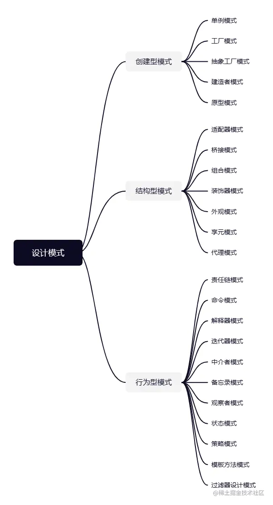
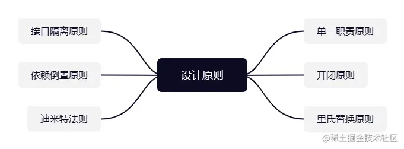

Java中的23种设计模式主要分为三类：

创建型模式：主要解决对象创建问题
结构型模式：主要解决对象组合问题
行为型模式：主要解决对象之间的交互问题

创建型模式
Java中的创建型设计模式主要用于对象的创建和组装。这些模式通过抽象化和解耦对象的创建过程，可以使系统更加灵活和可扩展。下面是Java中的5种创建型设计模式：

单例模式：确保一个类只有一个实例，并提供一个全局访问点。

工厂模式：在不暴露创建对象的逻辑的前提下，使用工厂方法来创建对象。

抽象工厂模式：提供一个接口，用于创建相关或依赖对象的系列，而不需要指定实际实现类。

建造者模式：将复杂对象的构建与表示分离，使得同样的构建过程可以创建不同的表示。

原型模式： 通过克隆来创建对象，避免了通过new关键字显式调用构造函数的开销。

结构型模式
Java中的结构型设计模式主要用于描述对象之间的关系，包括类和对象的组合、接口和继承等方面。这些模式可以帮助我们更好地组织和管理代码，提高代码的重用性和可维护性。下面是Java中的7种结构型设计模式：

适配器模式：将一个类的接口转换成客户希望的另一个接口，使得原本由于接口不兼容而无法一起工作的类可以一起工作。

桥接模式：将抽象部分与它的实现部分分离，以便它们可以独立地变化。

组合模式：将对象组合成树形结构以表示“部分-整体”的层次结构，使得客户端使用单个对象或者组合对象具有一致性。

装饰器模式：动态地给一个对象添加一些额外的职责，就增加功能而言，装饰器模式比生成子类方式更为灵活。

外观模式：为子系统中的一组接口提供一个一致的界面，使得子系统更容易使用。

享元模式：运用共享技术来有效地支持大量细粒度对象的复用。

代理模式：为其他对象提供一种代理以控制对这个对象的访问。

行为型模式
Java中的行为型设计模式主要用于描述对象之间的通信和协作方式，包括算法、责任链、状态等方面。这些模式可以帮助我们更好地组织和管理代码，提高代码的可维护性和可扩展性。下面是Java中的11种行为型设计模式：

责任链模式：为解除请求的发送者和接收者之间的耦合，而将请求的处理对象连成一条链，并沿着这条链传递请求，直到有一个对象处理它为止。

命令模式：将一个请求封装为一个对象，从而使你可用不同的请求对客户进行参数化；对请求排队或记录请求日志，以及支持可撤销的操作。

解释器模式：给定一个语言，定义它的文法的一种表示，并定义一个解释器，使用该解释器来解释语言中的句子。

迭代器模式：提供一种方法顺序访问一个聚合对象中各个元素，而又不需要暴露该对象的内部表示。

中介者模式：用一个中介对象封装一系列的对象交互，使得这些对象不需要显示地相互引用，从而降低耦合度。

备忘录模式：在不破坏封装性的前提下，捕获一个对象的内部状态，并在该对象之外保存这个状态。

观察者模式：定义对象间的一种一对多的依赖关系，当一个对象的状态发生改变时，所有依赖于它的对象都得到通知并自动更新。

状态模式：允许一个对象在其内部状态发生改变时改变其行为，对象看起来似乎修改了它的类。

策略模式：定义一系列的算法，将每个算法封装起来，并使它们之间可以互换。

模板方法模式：定义一个操作中的算法骨架，将一些步骤延迟到子类中。模板方法使得子类可以在不改变算法结构的情况下重新定义算法中的某些步骤。

过滤器设计模式：允许在不改变原始对象的情况下，动态地添加或删除对象的行为。

设计原则与设计模式
在了解完设计模式之后，我们再来了解下:六大设计原则

单一职责原则：一个类应该只有一个引起它变化的原因。换句话说，一个类应该只有一项职责。这样可以保证类的内聚性，并且降低类之间的耦合性。

开闭原则：一个软件实体如类、模块和函数应该对扩展开放，对修改关闭。这意味着当需要添加新功能时，应该尽量通过扩展已有代码来实现，而不是修改已有代码。

里氏替换原则：子类应该能够替换父类并且不影响程序的正确性。这意味着在使用继承时，子类不能修改父类已有的行为，而只能扩展父类的功能。

接口隔离原则：客户端不应该依赖于它不需要的接口。一个类应该只提供它需要的接口，而不应该强迫客户端依赖于它不需要的接口。

依赖倒置原则：高层模块不应该依赖于低层模块，它们都应该依赖于抽象。抽象不应该依赖于具体实现，而具体实现应该依赖于抽象。

迪米特法则：一个对象应该对其他对象保持最少的了解。换句话说，一个对象只应该与它直接相互作用的对象发生交互，而不应该与其它任何对象发生直接的交互。这样可以降低类之间的耦合性，提高系统的灵活性和可维护性。

设计模式与设计原则他们有什么不同呢？
设计原则和设计模式是面向对象设计中的两个重要概念，它们相互关联，但又有不同的含义和作用：

设计原则是一些通用的设计指导方针，它们提供了如何设计一个优秀的软件系统的基本思想和规则。指导着设计者如何组织代码以实现高内聚、低耦合、易扩展和易维护的软件系统。

设计模式则是在特定情况下解决常见问题的经验性解决方案，它们提供了如何实现这些设计原则的具体方法。

设计模式往往是在满足设计原则的基础上被应用的。设计模式可以看作是实现设计原则的一种具体方式。

